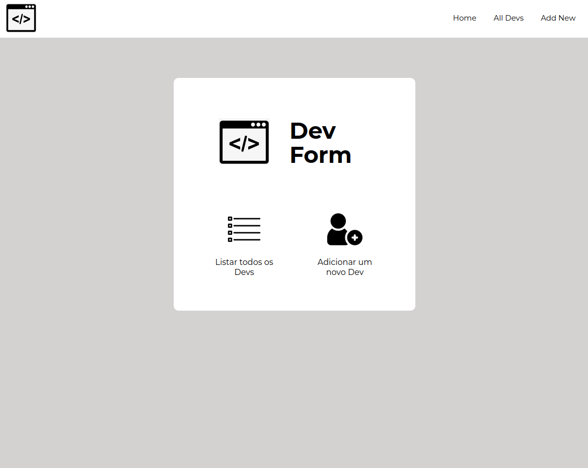
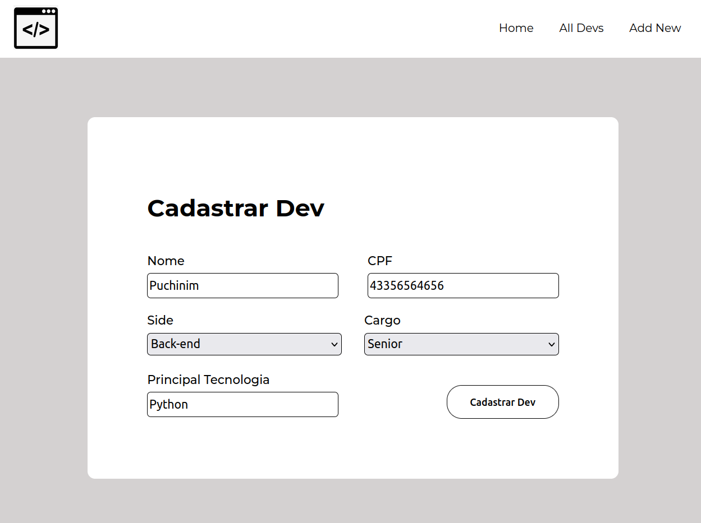
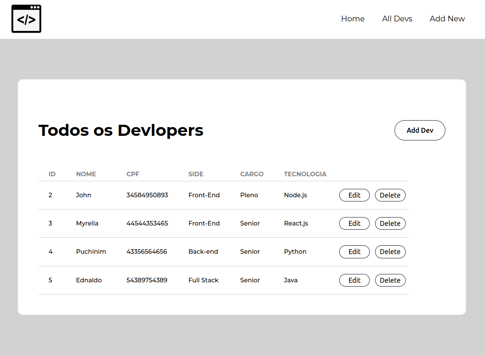
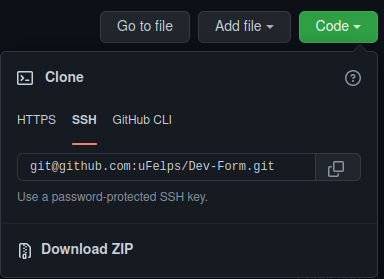
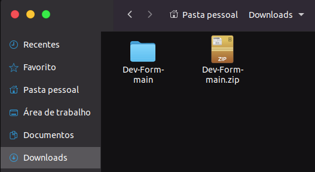
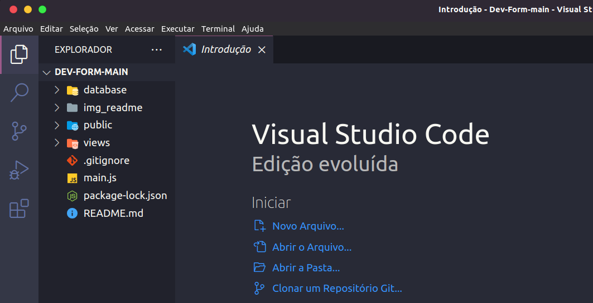
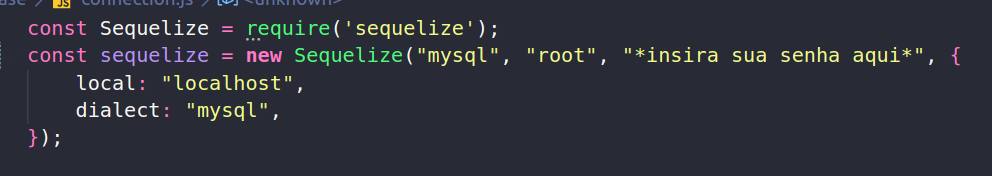
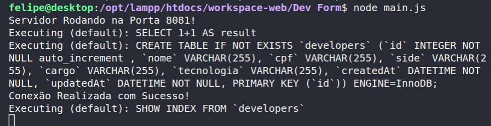

&nbsp;

&nbsp;

# DEV FORM

&nbsp;

### CRUD (Create, Read, Update, Delete) para controlar um sistema de Cadastros de Developers.

&nbsp;

<div align="center">
  
</div>
<div align="center">
  
</div>
<div align="center">
  
</div>

&nbsp;

&nbsp;


# Tecnologias Utilizadas

<div style="display: inline_block"><br>
    
    
    
  
  
  
  
 
&nbsp;

&nbsp;

# Como Utilizar:

&nbsp;

* Primeiramente, certifique-se que o pacote mysql está instalado na máquina

&nbsp;

### 1) Baixe o arquivo .zip, extraia e abra a pasta no Visual Studio Code.
<div align="center">
  
</div>
<div align="center">
  
</div>
<div align="center">
  
</div>


&nbsp;

### 2) Abra o terminal, e execute os comandos abaixos para instalar os pacotes necessários:

&nbsp;

````
npm install --save express
````
````
npm install --save express-handlebars
````
````
npm install --save body-parser
````
````
npm install --save sequelize
````
````
npm install --save mysql2
````

&nbsp;

### 3) Abra o Arquivo Connection.js, e insira a sua senha de root do banco de dados (caso não houver senha, deixe em branco).
<div align="center">
  
</div>

&nbsp;

### 4) Rode a aplicação com o seguinte comando no terminal: 
````
node main.js
````
Caso apareça isso, deu certo!
<div align="center">
  
</div>

&nbsp;

### 5) Acesse o navegador e digite:
````
http://localhost:8081/
````

<div align="center">
  
</div>


